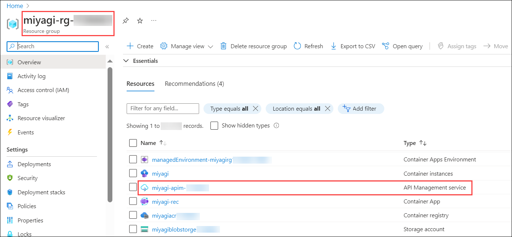
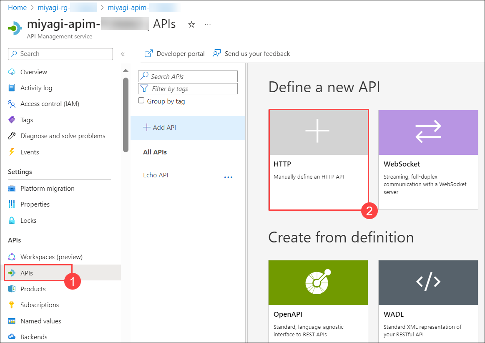
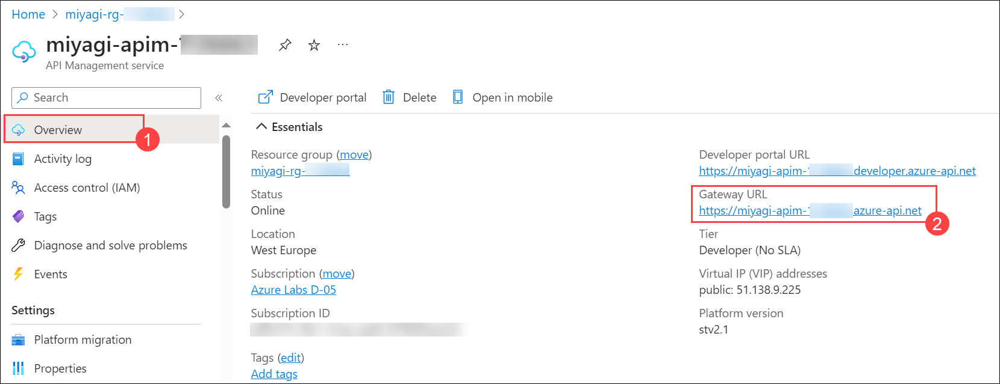
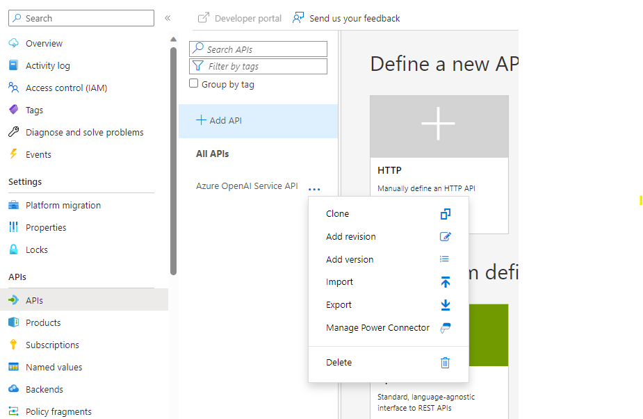
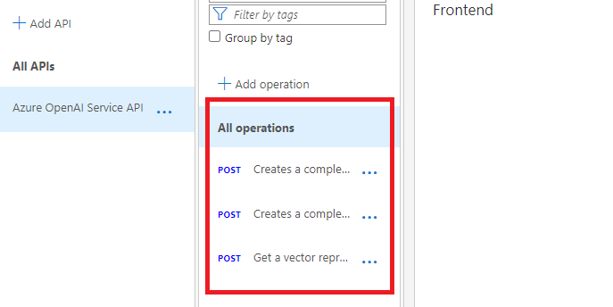
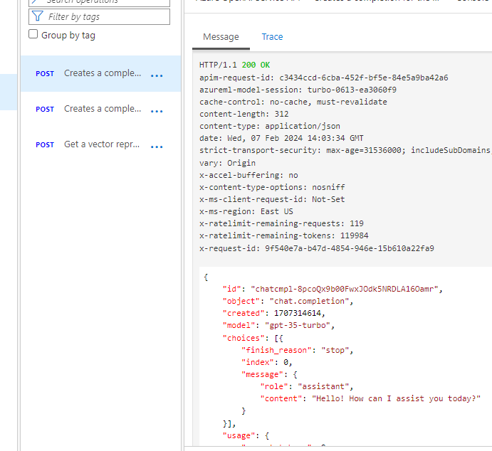
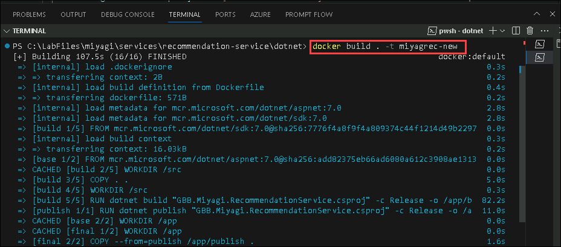
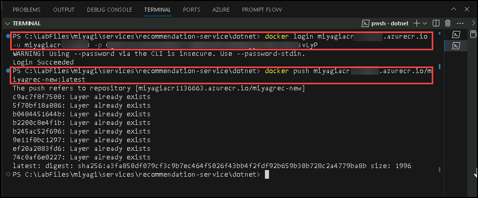
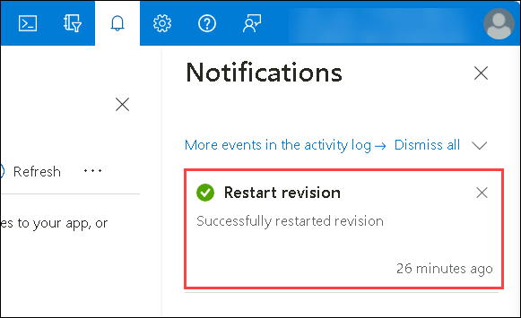
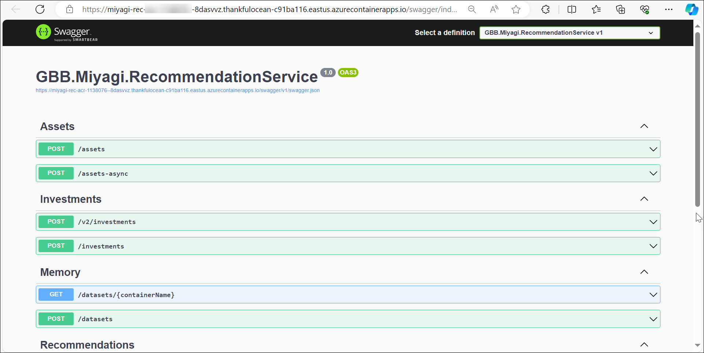

# Lab 3 - Expose Open AI through APIM

In this lab, you'll be verifying and creating APIs in the deployed API Management service to updating the Docker image for the Recommendation service. The revision of the Recommendation service from the Container App encapsulates the meticulous approach to maintaining and optimizing containerized applications within the project's scope.

### Task 1: Verify the deployed API Management service and create an API

1. Navigate to Azure portal, open the Resource Group named **miyagi-rg-<inject key="DeploymentID" enableCopy="false"/>**  and select **miyagi-apim-<inject key="DeploymentID" enableCopy="false"/>** API Management service from the resources list.

   

1. From the left-menu, click on **APIs** **(1)** and select **HTTP** **(2)** under Define a new API to create an HTTP API.

   

1. Enter the following values in the Create an HTTP API pane:
   
   | **Parameter**        | **Values**           | 
   | -------------------- | -------------------- | 
   | API Type **(1)**     | **Basic**            | 
   | Display name **(2)** | **miyagi-api**       |
   | Name **(3)**         | **miyagi-api**       |
   | Web service URL **(4)** | Enter the Endpoint of OpenAI resource named **OpenAIService-<inject key="DeploymentID" enableCopy="false"/>**  |
   | API URL suffix **(5)** | **openai** |
   | Click on  **(6)** | **Create** |

   

1. Once API is created, click on **Overview** **(1)** from the left-menu and copy the **Gateway URL** **(2)** of API Management service. Paste it into Notepad for later use.

   
  
### Task 2: Create API Management Policy and Roles

1. Inside of API Management select APIs and click on the three dots next to miyagi-api.
    

2. Select Import then OpenAPI. Once the popup shows paste the below link into the textbox, select update, and then click import. You should now see a series of APIs under the Azure OpenAI Service API.

   - https://raw.githubusercontent.com/Azure/azure-rest-api-specs/main/specification/cognitiveservices/data-plane/AzureOpenAI/inference/stable/2023-05-15/inference.json

    


3. Navigate to the products tab in the Azure API Management menu and select Add. For the display name and description you can enter OpenAI. Under the APIs menu click the plus sign and add the Azure OpenAI Service API.
    

4. Navigate to the subscriptions tab in the product menu and click add subscription.
   

5. Navigate to your OpenAI resource in the Azure Portal and select the Identity and Access Management tab. Select Add and role-assignment and at the next screen select Cognitive Services User, click next, then the managed identity radio button, and select memebers. In the managed identity drop down you should see your API Management, select the manage identity and click select. Once finished select Review and Assign and save the role assignment.
    

6. In the Azure Portal navigate back to the API Management resource and select APIs. Select the Azure OpenAI Service API create in the earlier step and select All Operations. Copy the below policy to overwrite the **inbound** tags only.
```
<inbound>
   <base />
   <set-header name="api-key" exists-action="delete" />
   <authentication-managed-identity resource="https://cognitiveservices.azure.com" output-token-variable-name="msi-access-token" ignore-error="false" />
   <set-header name="Authorization" exists-action="override">
      <value>@("Bearer " + (string)context.Variables["msi-access-token"])</value>
   </set-header>
   <set-backend-service base-url="https://<<API_MANAGMENT_URL>>/openai" />
</inbound>
```

7. Next navigate to the test tab in API Management next to settings and select **Creates a completion for the chat message**. In the deployment-id filed enter **gpt-35-turbo**. Inside the api-version field enter **2023-05-15** and click send. 
   

8. Scroll down the response and you should see a 200 response and a message back from your OpenAI service.
   

### Task 3: Update the Docker Image for Recommendation service

1. Navigate to Visual Studio Code, open the `appsettings.json` file from the path `C:\LabFiles\miyagi\services\recommendation-service\dotnet\appsettings.json`.

   

2. In the `appsettings.json` file, you have to replace the **endpoint** value from **OpenAI resource endpoint** to **API Gateway URL** which you have copied in Task-1 Step-4.

   

3. From the Explorer, navigate to `Miyagi/services/recommendation-service/dotnet/` **(1)** path. Right-click on `dotnet` folder and select **Open in Integrated Terminal** **(2)** from the options tab to open terminal with required path.

   

4. Now, you need to re-build the docker image for recommendation service by running the below docker command. Make to update the docker image name which was created earlier for recommendation service with the same name.

   ```
   docker build . -t [Docker_Image_Name_Recommendation_Service]
   ```

   

5. Run following command to ACR login.

   > **Note**: Please replace **[ACRname]** with **<inject key="AcrLoginServer" enableCopy="true"/>**, **[uname]** with **<inject key="AcrUsername" enableCopy="true"/>**, and **[password]** with **<inject key="AcrPassword" enableCopy="true"/>**.

    ```
    docker login [ACRname] -u [uname] -p [password]
    ```

6. Once you are logged into ACR. Run the below command to push the updated docker image of the recommendation service to the container registry.

   **Note**: Make sure to replace **[ACRname]** with **<inject key="AcrLoginServer" enableCopy="true"/>**.

   ```
   docker push [ACRname]/miyagi-recommendation:latest
   ```

   

### Task 4: Revision of Recommendation service from Container App

1. Navigate to Azure portal, open the Resource Group named **miyagi-rg-<inject key="DeploymentID" enableCopy="false"/>**  and select **miyagi-rec-ca-<inject key="DeploymentID" enableCopy="false"/>** Container App from the resources list.

   

1. In the **ca-miyagi-rec-<inject key="DeploymentID" enableCopy="false"/>** Container App pane, select **Revisions** **(1)** under Applications from left-menu and then open the **Active Revision** named **ca-miyagi-rec-<inject key="DeploymentID" enableCopy="false"/>** **(2)**.

   

1. You will see the **Revision details** pop-up in the right-side, click on **Restart**. You will see a pop-up to restart the revision, click on **Continue** to confirm.

   

   

1. You will see the notification once the Revision is restarted successfully.

   

1. Select **Ingress** **(1)** under Settings from the left menu and then scroll down to Endpoints of Container App i.e, **ca-miyagi-rec-<inject key="DeploymentID" enableCopy="false"/>-SUFFIX** **(2)**. Click on the secured link to open it.

   

1. You can see the swagger page for the recommendation service as shown in the below image:

   

### Task 5: Setup Event Hub Logging and Validate Input

1. Navigate to your event hub in the Azure Portal and select the Identity and Access Management tab. Select Add and role-assignment and at the next screen select Azure Event Hubs Data Sender, click next, then the managed identity radio button, and select memebers. In the managed identity drop down you should see your API Management, select the manage identity and click select. Once finished select Review and Assign and save the role assignment.
    

2. Navigate to your event hub in the Azure Portal and select event hubs, then select your event hub name. In the left menu select share access policies and create a new policy that can send data.
    

3. Next navigate to the shared access policy and copy the Connection string–primary key to your clip board.

4. Navigate to the `miyagi` root folder in your file explorer and create a new file called aoai-logger.bicep. Paste the content into that file and update the <<API_MANAGEMENT_NAME>> name and the <<EVENT_HUB_CONNECTION_STRING>> copied from the step above.
    ```
   resource existingApiManagement 'Microsoft.ApiManagement/service@2023-03-01-preview' existing = {
      name: '<<API_MANAGEMENT_NAME>>'
    }
    
    resource ehLoggerWithConnectionString 'Microsoft.ApiManagement/service/loggers@2023-05-01-preview' = {
      name: 'AOAILogger'
      parent: existingApiManagement
      properties: {
        loggerType: 'azureEventHub'
        description: 'Event hub logger with connection string'
        credentials: {
          connectionString: '<<EVENT_HUB_CONNECTION_STRING>>'
          name: 'ApimEventHub'
        }
      }
    }
    ```

5.  Navigate to the `miyagi` root folder in your terminal and execute the below command to run the bicep file.
   ```
    az deployment group create --resource-group <<RESOURCE_GROUP_NAME>> --template-file .\aoai-logger.bicep
   ```
    
6. In the Azure Portal navigate back to the API Management resource and select APIs. Select the Azure OpenAI Service API create in the earlier step and select All Operations. Copy the below policy to overwrite the **outbound** tags only.
```
<outbound>
   <base />
   <choose>
      <when condition="@(!context.Variables.GetValueOrDefault<bool>("isStream"))">
            <log-to-eventhub logger-id="AOAILogger" partition-id="0">@{
            var responseBody = context.Response.Body?.As<JObject>(true);
            return new JObject(
               new JProperty("prompt_tokens", responseBody["usage"]["prompt_tokens"].ToString()),
               new JProperty("total_tokens", responseBody["usage"]["total_tokens"].ToString())
            ).ToString();
      }</log-to-eventhub>
      </when>
   </choose>
</outbound>
```

7. Inside the Azure portal navigate to your Event Hub, select Event Hubs, and click on your event hub name. Next click process data and find the Process your Event Hub data using Stream Analytics Query Language and click start
    

8. Next open the Miyagi UI in a separate browser tab and change your stock preferences. In the Event Hub query you should see log information for the tokens used.
    